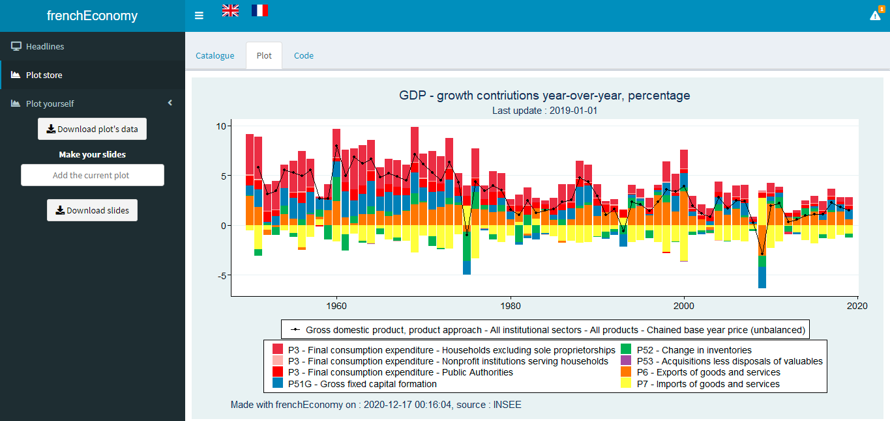

frenchEconomy R package
================

## Overview

*Experimental*

This package contains an R-Shiny Dashboard Displaying Data From INSEE.
This dashboard contains a library of pre-made plots and a plot generator.

This package is a contribution to reproducible research and public data transparency.

## Installation, Loading an Use

``` r
# Get the development version from GitHub
# install.packages("devtools")
# devtools::install_github("hadrilec/frenchEconomy"

library(frenchEconomy)

# Use
frenchEconomy()

```

## Dashboard




## Contributing

## Support

Feel free to contact me with any question about this package using this [e-mail address](mailto:hadrien.leclerc@insee.fr?subject=%5Br-package%5D%5Binsee%5D).
